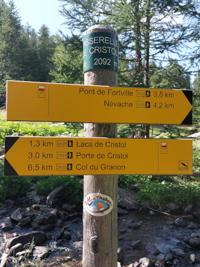
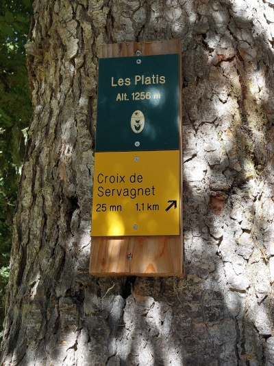
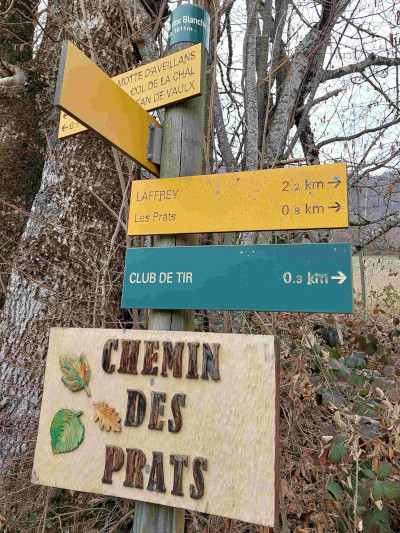
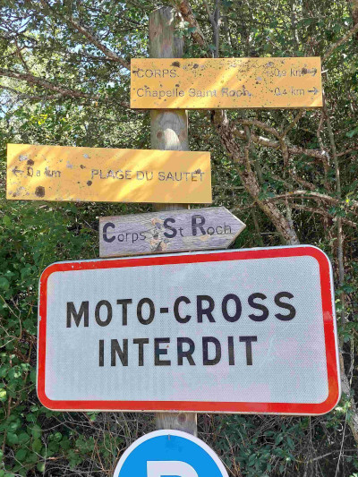
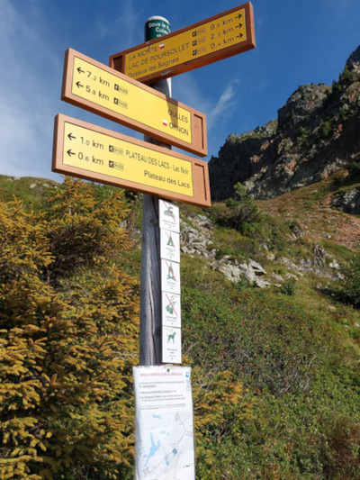
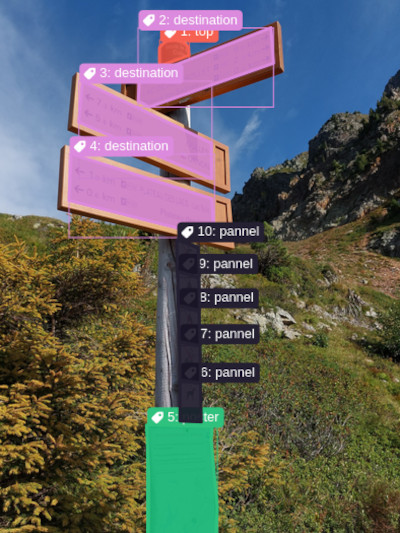
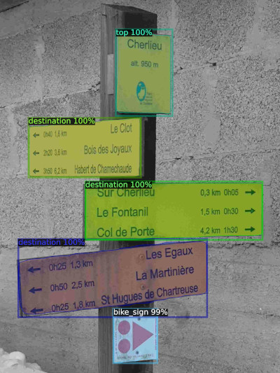
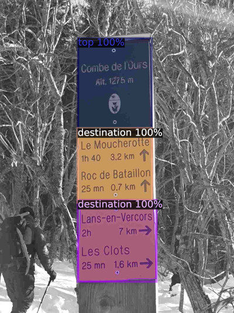

# 🚶‍♂️ Hiking Signs Detection and OCR 🧭

[🇫🇷 Version française](README_fr.md)

- The result of this work can be found in this [geojson file](./hikingSigns.geojson).
- Consider also adding those hiking signs to OSM using this [MapRoulette Challenge](https://maproulette.org/browse/challenges/49849) 🌍

## About this Repository 📚

### Origins 🌟

Since 2018, I have been taking pictures 📸 of every hiking sign that I came across during my hikes 🥾. These kinds of signs, also known as guideposts:

| On a Pole ⛳️ | On a Tree 🌳 |
|--------------|--------------|
|  |  |

My original idea was to just extract the location from the Exif data of the picture and then create a simple MapRoulette challenge to show the pictures and ask contributors to add the guidepost with its name and altitude ⛰️.

But in this first idea, you need to read the info on the picture and type it on your keyboard ⌨️. It's okay if you only set the name and the elevation of the guidepost. But it can be very long if you want to create the destination relations with their name, distance, and time ⏲️. It's even longer since there can be a lot of different destinations on each guidepost.

Since I have thousands of guidepost pictures 🖼️, it will take ages. So why not use OCR (character recognition)? My first approach was just a quick and dirty test. I simply created a Python script to loop through my thousands of guidepost pictures. The script would run OCR with the Python library EasyOCR and store the result in a geojson file. The result was terrible. EasyOCR was trying to recognize characters in every part of the image, including the background, forest 🌲, street signs 🚏, etc.

Example of pictures containing unwanted text:

| Indication Panel 🚫 | Restriction Panel 🛑 |
|----------------------|---------------------|
|  |  |

Running the OCR on full pictures was a bad idea, as it was trying to find letters and words everywhere. So I had to crop ✂️ my thousands of images to the inscriptions of the guideposts. To do so, I trained a model to recognize parts of the guideposts and also the signs that do not interest me in order to exclude them.

### Label Images with Label Studio 🏷️

Install [Label Studio](https://labelstud.io/):

```bash
# Create and activate python venv
python -m venv venv
source venv/bin/activate
# Install and run label-studio
pip install -U label-studio
label-studio
```

Then Label Studio opens itself in your web browser 🌐.

1. I created 2 projects "Hiking Sign Train 🚞" and "Hiking Sign Test 🧪".
2. For both, I selected the type `Semantic Segmentation with Polygons` 📐.
3. I created my categories and set IDs:

```xml
<View>
  <Header value="Select label and click the image to start"/>
  <Image name="image" value="$image" zoom="true" zoomControl="true"/>
  <PolygonLabels name="label" toName="image" strokeWidth="3" pointSize="small" opacity="0.9">
    <Label category="1" value="top" background="#f66151"/>
    <Label category="2" value="destination" background="#dc8add"/>
    <Label category="3" value="poster" background="#2ec27e"/>
    <Label category="4" value="bike_sign" background="#e66100"/>
    <Label category="5" value="street_sign" background="#865e3c"/>
    <Label category="6" value="panel" background="#241f31"/>
  </PolygonLabels>
</View>
```

4. I imported 100 pictures into the train project and 15 into the test project.
5. Then I started to manually annotate each picture, like this ✏️:

| Without Annotation ❌ | With Annotations ✔️ |
|-----------------------|---------------------|
|  |  |

I drew polygons around each element:
1. **top**: for the cap of the guidepost. Some guideposts don't have it. The top can be yellow or green.
2. **destination**: for the possible destinations. Usually, they have a name, a number of kilometers, and some have an estimated duration in hours. Most of them also have arrows and a yellow background.
3. **poster**: for posters, usually regulations or for lost dogs 🐶 and cats 🐱.
4. **bike_sign**: for dedicated bicycle signs 🚴.
5. **street_sign**: for road regulations or street name signs 🚏, etc.
6. **panel**: for tiny regulation panels like no fire 🔥, no swimming 🏊, etc.

I annotated both my training pictures and test pictures and exported my project from Label Studio as a COCO format zip file. I then extracted the zip files into folders: `coco-test-hiking-sign` and `coco-train-hiking-sign`.

### Get Ready to Train a Model 🖥️

Then I wrote a Python script to train a model. I used [PyTorch](https://pytorch.org/) and the open-source framework [Detectron2](https://github.com/facebookresearch/detectron2) for object detection in my pictures.

First, I trained my model on my laptop 💻, which is old and doesn't have a good GPU. The training lasted for 2.5 hours for only 500 iterations. Then I used this model on my pictures, and the result was terrible. My model was barely detecting the different parts of the guidepost and was misidentifying them.

So I used a desktop computer with an NVIDIA GPU 🎮. As it was not my computer, I had to use WSL since `Detectron2` is compatible only with Linux systems 🐧.

1. Install [WSL](https://github.com/microsoft/WSL)
2. Install Ubuntu on WSL 2+
3. Install Python, NVIDIA drivers, and other packages:

```bash
apt install python3 python3-dev git ubuntu-drivers nvidia-smi
ubuntu-drivers list --gpgpu
# I tried the 'open' driver but it didn't work
ubuntu-drivers install nvidia:550
# Instructions from https://developer.nvidia.com/cuda-downloads?target_os=Linux&target_arch=x86_64&Distribution=WSL-Ubuntu&target_version=2.0&target_type=deb_network
wget https://developer.download.nvidia.com/compute/cuda/repos/wsl-ubuntu/x86_64/cuda-keyring_1.1-1_all.deb
dpkg -i cuda-keyring_1.1-1_all.deb
apt-get update
apt-get -y install cuda-toolkit-12-6
nvidia-smi
```

4. The last command should show info about your GPU and the CUDA version.

Now you can try this script to see if PyTorch can use your NVIDIA GPU:

```bash
# Activate python venv
source venv/bin/activate
pip wheel
pip install torch torchvision
python 11-testGpu.py
```

Then I finally installed Detectron2:

```bash
git clone https://github.com/facebookresearch/detectron2.git
pip install -e detectron2
```

### Train a Model 🏋️‍♂️

```bash
python 20-trainObjectDetectionModel.py
```

With 500 iterations, the training lasted for 5 minutes on this computer instead of 2.5 hours on my laptop. But still, the model was terrible. So I increased the iterations to 5000+, the training lasted around 2 hours, and the model was "PERFECT" 🥳. I was quite happy with the result.

### Test My Model 🔬

So I tested my model by using it to annotate my pictures:

```bash
python 21-testObjectDetectionModel.py
```

Here is a visualization of objects detected by my model:

| Detection 🔍 | Detection 🔍 |
|--------------|--------------|
|  |  |

As you can see, my model is pretty confident in recognizing the top and destination panels of guideposts.

### Use the Model to Crop Pictures ✂️

Now that the model is trained, I wrote another script to crop images according to the given top and destination areas. It outputs cropped images in folders `crop/top` and `crop/destination`.

```bash
python 22-cropUsingObjectDetectionModel.py
```

### Create a MapRoulette Challenge 🌐

In order to create my MapRoulette challenge, I needed to upload my pictures on a website 🌍. Of course, I chose [Panoramax](https://panoramax.openstreetmap.fr/). I used the old command line tool `geovisio` to upload my pictures on Panoramax because it creates a `toml` report file.

Now it is time to create a geojson to regroup all the information. The following script:
1. Extracts latitude and longitude from image Exif data 🗺️.
2. Extracts the Panoramax image URL from the geovisio toml file 📝.
3. Loops through every cropped image and uses OCR on them to extract text 🖋️.
4. Creates a geojson feature for each picture 🌍.
5. Finally outputs a geojson file with all this data 📄.

Then, you can open this geojson file with JOSM and convert it into an `osm` file. Use [mr-cli](https://github.com/maproulette/mr-cli) to convert this osm file into a MapRoulette Cooperative Challenge geojson file:

```bash
mr cooperative change --out hikingSignsCoopMrChallenge.json hikingSigns.osm
```

Finally, create the challenge on MapRoulette and upload the geojson file. The challenge can be found here: [MapRoulette Challenge](https://maproulette.org/browse/challenges/49849) 🌟.

# What's Next 🔮

- Work in Progress: use vision llm to extract characters from images instead of classic OCR 🤖.
- Fix panels' perspectives to make OCR work better 🛠️.
