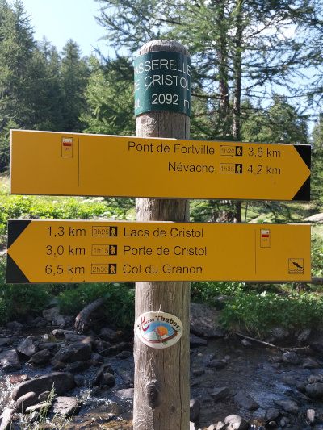
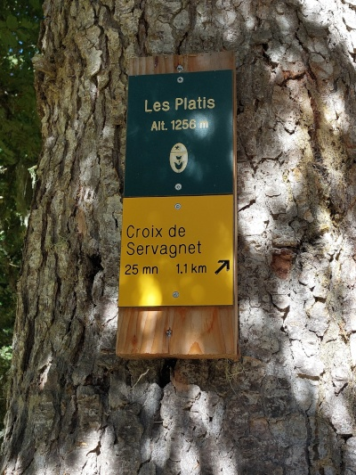
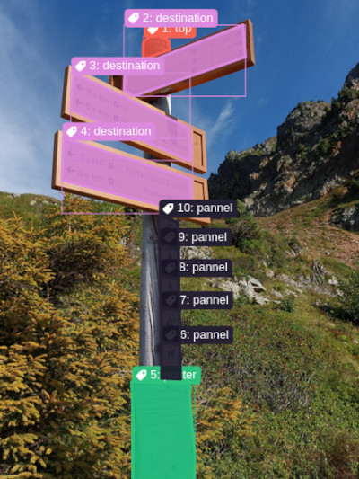
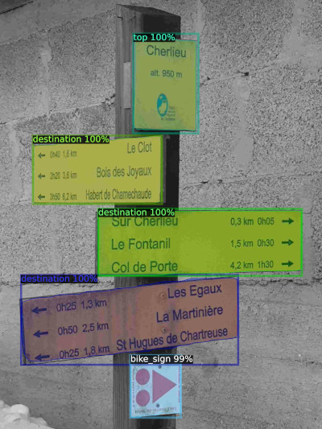

# 🚶‍♂️ Détection et OCR des Panneaux de Randonnée 🧭

[🇬🇧 English version](README.md)

- Le résultat de ce travail peut être trouvé dans ce [fichier geojson](./hikingSigns.geojson).
- Ajoutez ces panneaux de randonnée dans OSM en utilisant ce [défi MapRoulette](https://maproulette.org/browse/challenges/49849) 🌍

## À propos de ce dépôt 📚

### Origines 🌟

Depuis 2018, j'ai commencé à prendre des photos 📸 de chaque panneau de randonnée que j'ai rencontré lors de mes randonnées 🥾. Ces types de panneaux, également connus sous le nom de poteaux de signalisation :

| Sur un poteau ⛳️ | Sur un arbre 🌳 |
|------------------|-----------------|
|  |  |

Mon idée originale était simplement d'extraire l'emplacement des données Exif de la photo puis de créer un défi MapRoulette simple pour montrer les photos et demander aux contributeurs d'ajouter le poteau de signalisation avec son nom et son altitude ⛰️.

Mais dans cette première idée, vous devez lire les informations sur la photo et les taper sur votre clavier ⌨️. C'est correct si vous ne définissez que le nom et l'altitude du poteau de signalisation. Mais cela peut être très long si vous voulez créer la relation de destination avec leur nom, leur distance et leur temps ⏲️. C'est encore plus long car il peut y avoir beaucoup de destinations différentes sur chaque poteau de signalisation.

Comme j'ai des milliers de photos de poteaux de signalisation 🖼️, cela prendrait des siècles. Alors pourquoi ne pas utiliser l'OCR (reconnaissance de caractères) ? Mon premier abord était juste un test rapide et salissant. J'ai simplement créé un script Python 🐍 pour parcourir mes milliers de photos de poteaux de signalisation. Le script exécutait l'OCR avec la bibliothèque Python EasyOCR et stockait le résultat dans un fichier geojson. Le résultat était terrible. EasyOCR essayait de reconnaître des caractères dans chaque partie de l'image, y compris l'arrière-plan, la forêt 🌲, les panneaux de rue 🚏, etc.

Exemple de photos contenant du texte indésirable 📝 :

| Panneau de restriction 🚫 | Panneau d'indication 🛑 |
|---------------------------|------------------------|
|  |  |

L'exécution de l'OCR sur des photos complètes était une mauvaise idée, car il essayait de trouver des lettres et des mots partout. J'ai donc dû recadrer ✂️ mes milliers d'images aux inscriptions des poteaux de signalisation. Pour ce faire, j'ai entraîné un modèle pour reconnaître les parties des poteaux de signalisation et aussi les panneaux qui ne m'intéressaient pas afin de les exclure.

### Étiqueter les images avec Label Studio 🏷️

Installez [Label Studio](https://labelstud.io/) :

```bash
# Créer et activer un python venv
python -m venv venv
source venv/bin/activate
# Installer et exécuter label-studio
pip install -U label-studio
label-studio
```

Label Studio s'ouvrira ensuite dans votre navigateur web 🌐.

1. J'ai créé 2 projets "Hiking Sign Train 🚞" et "Hiking Sign Test 🧪".
2. Pour les deux, j'ai sélectionné le type `Semantic Segmentation with Polygons` 📐.
3. J'ai créé mes catégories et défini les ID :

```xml
<View>
  <Header value="Sélectionnez l'étiquette et cliquez sur l'image pour commencer"/>
  <Image name="image" value="$image" zoom="true" zoomControl="true"/>
  <PolygonLabels name="label" toName="image" strokeWidth="3" pointSize="small" opacity="0.9">
    <Label category="1" value="top" background="#f66151"/>
    <Label category="2" value="destination" background="#dc8add"/>
    <Label category="3" value="poster" background="#2ec27e"/>
    <Label category="4" value="bike_sign" background="#e66100"/>
    <Label category="5" value="street_sign" background="#865e3c"/>
    <Label category="6" value="panel" background="#241f31"/>
  </PolygonLabels>
</View>
```

4. J'ai importé 100 photos dans le projet de formation et 15 dans le projet de test.
5. Ensuite, j'ai commencé à annoter manuellement chaque photo, comme ceci ✏️ :

| Sans annotation ❌ | Avec annotations ✔️ |
|--------------------|---------------------|
|  |  |

J'ai dessiné des polygones autour de chaque élément :
1. **top** : pour le capuchon du poteau de signalisation. Certains poteaux de signalisation n'en ont pas. Le capuchon peut être jaune ou vert.
2. **destination** : pour les destinations possibles. En général, elles ont un nom, un nombre de kilomètres et certaines ont une durée estimée en heures. La plupart d'entre elles ont aussi des flèches et un fond jaune.
3. **poster** : pour les affiches, généralement des réglementations ou pour les chiens 🐶 et les chats 🐱 perdus.
4. **bike_sign** : pour les panneaux de signalisation dédiés aux vélos 🚴.
5. **street_sign** : pour les réglementations routières ou les panneaux de nom de rue 🚏, etc.
6. **panel** : pour les petits panneaux de réglementation comme pas de feu 🔥, pas de baignade 🏊, etc.

J'ai annoté à la fois mes photos d'entraînement et de test et exporté mon projet de Label Studio au format zip COCO. J'ai ensuite extrait les fichiers zip dans les dossiers : `coco-test-hiking-sign` et `coco-train-hiking-sign`.

### Préparez-vous à entraîner un modèle 🖥️

Ensuite, j'ai écrit un script Python pour entraîner un modèle. J'ai utilisé [PyTorch](https://pytorch.org/) et le framework open-source [Detectron2](https://github.com/facebookresearch/detectron2) pour la détection d'objets dans mes images.

Tout d'abord, j'ai entraîné mon modèle sur mon ordinateur portable 💻, qui est ancien et n'a pas un bon GPU. L'entraînement a duré 2,5 heures pour seulement 500 itérations. Ensuite, j'ai utilisé ce modèle sur mes images, et le résultat était terrible. Mon modèle détectait à peine les différentes parties du poteau indicateur et les identifiait incorrectement.

Alors, j'ai utilisé un ordinateur de bureau avec un GPU NVIDIA 🎮. Comme ce n'était pas mon ordinateur, j'ai dû utiliser WSL car `Detectron2` est compatible uniquement avec les systèmes Linux 🐧.

1. Installer [WSL](https://github.com/microsoft/WSL)
2. Installer Ubuntu sur WSL 2+
3. Installer Python, les pilotes NVIDIA et d'autres paquets :

```bash
apt install python3 python3-dev git ubuntu-drivers nvidia-smi
ubuntu-drivers list --gpgpu
# J'ai essayé le pilote 'open' mais il n'a pas fonctionné
ubuntu-drivers install nvidia:550
# Instructions provenant de https://developer.nvidia.com/cuda-downloads?target_os=Linux&target_arch=x86_64&Distribution=WSL-Ubuntu&target_version=2.0&target_type=deb_network
wget https://developer.download.nvidia.com/compute/cuda/repos/wsl-ubuntu/x86_64/cuda-keyring_1.1-1_all.deb
dpkg -i cuda-keyring_1.1-1_all.deb
apt-get update
apt-get -y install cuda-toolkit-12-6
nvidia-smi
```

4. La dernière commande devrait afficher des informations sur votre GPU et la version CUDA.

Maintenant, vous pouvez essayer ce script pour voir si PyTorch peut utiliser votre GPU NVIDIA :

```bash
# Activer l'environnement virtuel Python
source venv/bin/activate
pip wheel
pip install torch torchvision
python 11-testGpu.py
```

Ensuite, j'ai finalement installé Detectron2 :

```bash
git clone https://github.com/facebookresearch/detectron2.git
pip install -e detectron2
```

### Entraîner un modèle 🏋️‍♂️

```bash
python 20-trainObjectDetectionModel.py
```

Avec 500 itérations, l'entraînement a duré 5 minutes sur cet ordinateur au lieu de 2,5 heures sur mon ordinateur portable. Mais le modèle était toujours terrible. Alors, j'ai augmenté le nombre d'itérations à plus de 5000, l'entraînement a duré environ 2 heures, et le modèle était "PARFAIT" 🥳. J'étais très satisfait du résultat.

### Tester mon modèle 🔬

J'ai donc testé mon modèle en l'utilisant pour annoter mes images :

```bash
python 21-testObjectDetectionModel.py
```

Voici une visualisation des objets détectés par mon modèle :

| Détection 🔍 | Détection 🔍 |
|--------------|--------------|
|  |  |

Comme vous pouvez le voir, mon modèle est assez confiant dans la reconnaissance des panneaux supérieurs et des panneaux de destination des poteaux indicateurs.

### Utiliser le modèle pour recadrer les images ✂️

Maintenant que le modèle est entraîné, j'ai écrit un autre script pour recadrer les images selon les zones des panneaux supérieurs et des destinations données. Il produit des images recadrées dans les dossiers `crop/top` et `crop/destination`.

```bash
python 22-cropUsingObjectDetectionModel.py
```

### Créez un défi MapRoulette 🌐

Pour créer mon défi MapRoulette, j'ai besoin de télécharger mes photos sur un site web 🌍. Bien sûr, j'ai choisi [Panoramax](https://panoramax.openstreetmap.fr/). J'ai utilisé l'ancien outil en ligne de commande `geovisio` pour télécharger mes photos sur Panoramax car il crée un fichier de rapport `toml`.

Il est maintenant temps de créer un geojson pour regrouper toutes les informations. Le script suivant :
1. Extrait la latitude et la longitude à partir des données Exif de l'image 🗺️.
2. Extrait l'URL de l'image Panoramax à partir du fichier toml de geovisio 📝.
3. Parcourt chaque image recadrée et utilise OCR pour extraire le texte 🖋️.
4. Crée une fonctionnalité geojson pour chaque photo 🌍.
5. Enfin, génère un fichier geojson avec toutes ces données 📄.

Ensuite, vous pouvez ouvrir ce fichier geojson avec JOSM et le convertir en un fichier `osm`. Utilisez [mr-cli](https://github.com/maproulette/mr-cli) pour convertir ce fichier osm en un fichier geojson de défi coopératif MapRoulette :

```bash
mr cooperative change --out hikingSignsCoopMrChallenge.json hikingSigns.osm
```

Enfin, créez le défi sur MapRoulette et téléchargez le fichier geojson. Le défi peut être trouvé ici : [Défi MapRoulette](https://maproulette.org/browse/challenges/49849) 🌟.

# Et après ? 🔮

- Travaux en cours : utiliser vision llm pour extraire des caractères des images au lieu de l'OCR classique 🤖.
- Corriger les perspectives des panneaux pour améliorer le fonctionnement de l'OCR 🛠️.
